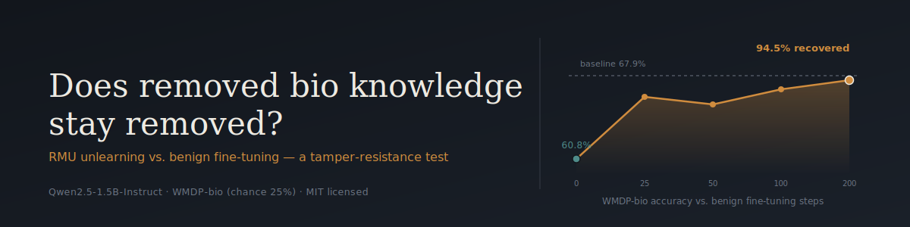

I took a small open-weight language model, used a published unlearning method (RMU) to
strip out its ability to answer hazardous-biology proxy questions, and then fine-tuned it
on completely ordinary, harmless text to see whether that ability came back. It came back
almost all the way, in under 200 training steps, with no attempt whatsoever to defeat the
safeguard. That's the whole project in one sentence — everything else here is how I got
that number and how much you should trust it.

## Why I ran this

There's an ongoing argument in AI safety research about whether "unlearning" — training a
model to stop using a capability, as opposed to never teaching it that capability in the
first place — actually produces something durable. Stephen Casper and others have argued
that most post-training unlearning is shallow: it suppresses a capability rather than
removing it, and a little ordinary fine-tuning can bring it back. I wanted to see that for
myself rather than take the argument on faith, so I built the smallest version of this
experiment I could run on a single GPU and watched what actually happened.

WMDP-bio, the benchmark I used to measure this, is a public multiple-choice test built by
biosecurity and AI-safety researchers specifically so people can study this question
without touching anything actually dangerous. I only ever used it to score the model —
I never read its questions for content, and nothing in this repo trains on hazardous
material of any kind.

## What happened

| | WMDP-bio accuracy |
|---|---|
| Base model, no unlearning | 67.9% |
| After RMU unlearning | 60.8% |
| After 25 steps of benign fine-tuning (lr 5e-5) | 66.1% |
| After 200 steps of benign fine-tuning (lr 5e-5) | 67.5% |

Random guessing on this benchmark scores 25%, so the model never came close to actually
forgetting anything — unlearning knocked about 7 points off a 68-point score, and a few
hundred steps of ordinary instruction-tuning data put nearly all of it back. Neither
recovery curve had leveled off by step 200, so the true ceiling is probably even closer to
full recovery. The complete tuning history, both learning rates, and the reasoning behind
every choice are in `report/writeup.md`. A one-page plain-language version is in
`SUMMARY.md`.

## Repo layout

```
.
├── configs/default.yaml     # every tunable, including the final chosen hyperparameters
├── src/
│   ├── common.py            # config loading, seeding, model loading, IO
│   ├── eval.py               # runs lm-eval (wmdp_bio, mmlu), writes normalized JSON
│   ├── unlearn.py             # the RMU implementation
│   ├── attack.py              # one adversarial (benign) fine-tuning run
│   └── sweep.py               # drives the learning-rate/step grid, builds the recovery chart
├── tests/                    # mechanics tests on a tiny synthetic model, no GPU needed
├── notebooks/                # the Colab notebooks actually used to run each phase
└── results/                  # every JSON result plus recovery_curve.png
```

## Running it yourself

The machine this code lives on has no GPU and not enough RAM to load the model at all —
I confirmed that the hard way, it segfaults. Everything that touches the model ran on
Google Colab instead. To reproduce:

```bash
python -m venv .venv
.venv/Scripts/pip install -r requirements.txt
```

Then, with a GPU runtime on Colab, run these notebooks in order:

```
notebooks/phase0_setup.ipynb     # loads the base model, one test generation
notebooks/phase1_baseline.ipynb  # scores the base model, writes results/baseline.json
notebooks/phase3_attack.ipynb    # regenerates the unlearned model AND runs the attack sweep
```

`phase3_attack.ipynb` does both the unlearning and the attack in one run. Colab sessions
don't persist anything between sessions unless you download it yourself, so rather than
saving and reloading a multi-gigabyte checkpoint across two separate sessions, that
notebook's first step regenerates the exact final RMU config deterministically and then
immediately attacks it. `notebooks/phase2_unlearn.ipynb` is kept around only because it's
the notebook I actually used while tuning the RMU hyperparameters — it's not part of the
reproduction path, and the config it eventually converged on is what's in
`configs/default.yaml` and what `phase3_attack.ipynb` regenerates.

## What I'd flag before trusting these numbers too much

The official WMDP-bio forget corpus is gated behind an access request I chose not to file,
so I substituted an open PubMed article corpus instead. It's the same general domain
(biomedical literature) but wasn't curated for the specific hazard-adjacent content the
real corpus targets, which probably means my unlearning is weaker and less targeted than
what the original RMU authors would get. The model is also much smaller than the ones RMU
was originally tuned on — 1.5 billion parameters against 7 billion and up — so I had to
re-derive the hyperparameters myself rather than reuse published ones, and the specific
numbers here shouldn't be read as a precise replication of anyone else's results. Finally,
this is one run on one seed with one architecture and a fine-tuning budget that stopped at
200 steps; the recovery curves were still climbing when I stopped, so the honest ceiling
is probably higher than what's reported.

## Responsible use

This is a defensive-research project: the entire point was to measure whether a safety
method holds up, not to make a model more capable of anything dangerous. WMDP-bio was used
exclusively as a scoring instrument — its multiple-choice questions are proxies built for
measurement, and I never mined them for content or used them as training data. The
fine-tuning data used to test whether the safeguard held (`tatsu-lab/alpaca`) is a fully
benign, open instruction dataset with nothing hazardous in it. No model checkpoint from any
stage of this project — unlearned or "recovered" — has been uploaded or published anywhere;
they only ever existed transiently on a Colab instance and were discarded after each run.
