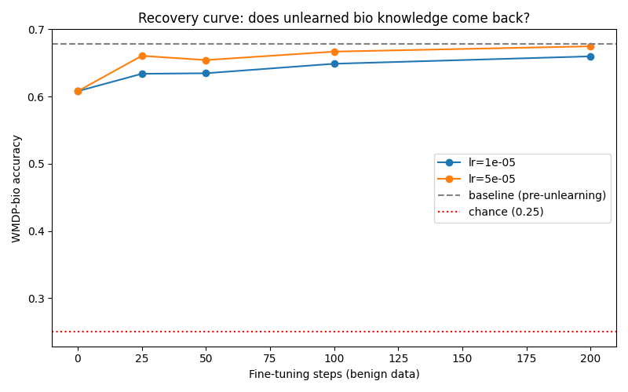

# Does removed bio knowledge stay removed? A small-scale test of RMU's tamper-resistance

## Abstract

I unlearned hazardous-biology proxy knowledge from Qwen2.5-1.5B-Instruct using RMU
(Representation Misdirection for Unlearning, Li et al. 2024), then fine-tuned the
resulting model on benign, general-domain instruction data to see whether the suppressed
capability returned. It did: at a learning rate of 5e-5, 25 steps of ordinary fine-tuning
recovered 74% of the suppression, and 200 steps recovered 94.5%, landing the model almost
exactly back at its pre-unlearning WMDP-bio score. This is a small, honest data point in
favor of the concern raised by Stephen Casper's tamper-resistance work: unlearning methods
like RMU suppress a capability rather than removing it, and that suppression does not
survive contact with ordinary, non-adversarial fine-tuning once the weights are in
someone else's hands.

## Setup

Model: Qwen2.5-1.5B-Instruct, 28 transformer layers, hidden size 1536. I picked a small
model deliberately, both because it's what a single consumer GPU can handle and because
the whole point is testing what happens once weights are downloadable and fine-tunable by
anyone — a scenario that applies far more to small open models than to frontier ones kept
behind an API.

Measurement: WMDP-bio, a public four-choice benchmark (chance level 25%) built to measure
hazardous-biology-adjacent knowledge without containing operational hazardous content
itself. I used it strictly as a scoring instrument throughout — no script in this project
reads, quotes, or trains on its questions. MMLU served as the general-capability check, to
catch unlearning that damages the model broadly rather than the targeted capability.

Environment: evaluation and training both ran on Google Colab GPUs (T4 for Phases 0-1, L4
for the tuning and sweep phases), driven from a local machine that itself has no GPU and
insufficient RAM to load the model at all.

## Method

### RMU

RMU works by picking a layer partway through the network, then training a small set of
parameters (here, the MLP down-projection weights of that layer and the two preceding it)
so that on "forget set" text, the layer's activations get pushed toward a fixed random
vector, while a retain-set loss keeps activations on benign text close to a frozen copy of
the original model. Everything outside those three weight matrices stays frozen.

Two things needed correcting before this worked on Qwen2.5-1.5B at all, and I want to be
specific about both since they're the kind of detail that's easy to get subtly wrong when
porting a method to a new model:

**Layer depth.** My working assumption going in was that the target layer should sit
around 40-60% of the way through the network. That didn't match what the reference RMU
implementation actually does — checking their code directly, Zephyr-7B (32 layers) uses
layer 7 (about 22% depth), and Yi-34B (60 layers) uses layer 15 (about 25% depth). I
corrected to layer 6 of 28 (about 21%) to match that pattern, targeting layers 4 through 6.

**Control vector scale.** The reference implementation's `steering_coeff` values are raw
constants — 6.5 for Zephyr-7B, up to 300 for larger models — tuned to each specific
model's activation magnitude at its chosen layer. My first attempt reused 6.5 literally.
It had no effect at all: the forget loss sat flat around 160-180 for the entire 150-step
run, and WMDP-bio didn't move (67.87% baseline versus 67.79% after "unlearning" — noise).
The reason became clear once I measured the model's actual mean squared activation at
layer 6: about 163. A control vector with L2 norm 6.5, spread across 1536 dimensions,
contributes on the order of 0.03 to the per-element squared error against that — roughly
4,000 times too small to move anything. I fixed this by measuring the real activation
scale on a few forget-set batches before training, then scaling the control vector to
`steering_coeff * sqrt(measured_mean_squared_activation) * sqrt(hidden_size)`, making
`steering_coeff` a multiplier of the model's own scale rather than an arbitrary constant
borrowed from a different model family. With this fix, `steering_coeff=6.5` produced a
control vector of norm 3,248 rather than 6.5, and the forget loss immediately started
moving.

### Datasets

Forget set: the actual WMDP-bio forget corpus (`cais/wmdp-bio-forget-corpus`) is gated
behind an access request. I chose not to file it and substituted `ccdv/pubmed-summarization`
instead — open PubMed article abstracts and bodies, same broad domain but not curated for
the specific hazard-adjacent content the official corpus targets. This almost certainly
means weaker, less targeted suppression than the published method would achieve with its
intended data.

Retain set: `Salesforce/wikitext` (the `wikitext-2-raw-v1` config), matching what the
reference implementation actually pairs the forget corpus with in its own released code,
despite a topically-matched retain corpus also being available.

Attack (Phase 3) data: `tatsu-lab/alpaca`, 52,000 open instruction-response pairs, entirely
benign — general help-with-tasks content, nothing hazardous, and nothing chosen to be
adversarial toward the unlearning in any way.

### Hyperparameter search

I swept `steering_coeff` against the corrected calibration to find where WMDP-bio drops
meaningfully without MMLU collapsing, holding layer selection, alpha, learning rate, and
step count fixed:

| steering_coeff | WMDP-bio | Δ vs. baseline | MMLU | Δ vs. baseline |
|---|---|---|---|---|
| 2 | 67.71% | -0.16pt | 61.99% | -0.16pt |
| 3 | 67.48% | -0.39pt | 61.46% | -0.68pt |
| **4 (chosen)** | **60.80%** | **-7.07pt** | **58.21%** | **-3.93pt** |
| 5 | 49.73% | -18.15pt | 54.52% | -7.63pt |
| 6.5 | 37.71% | -30.16pt | 46.69% | -15.46pt |

Below 4, the effect is indistinguishable from noise given the ~1.3-point standard error on
WMDP-bio. Above 4, MMLU degrades faster than WMDP-bio improves as a target for
"unlearning that stays targeted." I chose `steering_coeff=4` as the point with a clearly
real WMDP-bio drop and the smallest MMLU cost among the settings that showed any real
effect at all.

Final RMU configuration: layer_id 6, layers 4-6 updated, steering_coeff 4 (control vector
norm 2000), alpha 1200, learning rate 5e-5, 150 steps, batch size 4, sequence length 512,
seed 0.

## Results

### Baseline (before unlearning)

| Task | Accuracy | n | Chance level |
|---|---|---|---|
| WMDP-bio | 67.87% | 1,273 | 25% |
| MMLU | 62.15% | 12,173 | 25% |

### After RMU unlearning

| Task | Accuracy | Δ vs. baseline |
|---|---|---|
| WMDP-bio | 60.80% | -7.07pt |
| MMLU | 58.21% | -3.93pt |

### Recovery under benign fine-tuning

WMDP-bio accuracy at each checkpoint, and the percentage of the 7.07-point suppression gap
that had been recovered relative to the unlearned floor (60.80%) and the pre-unlearning
baseline (67.87%):

| Steps | lr = 1e-5 | % gap recovered | lr = 5e-5 | % gap recovered |
|---|---|---|---|---|
| 0 | 60.80% | 0% | 60.80% | 0% |
| 25 | 63.39% | 36.7% | 66.06% | 74.4% |
| 50 | 63.47% | 37.8% | 65.44% | 65.6% |
| 100 | 64.89% | 57.8% | 66.69% | 83.3% |
| 200 | 65.99% | 73.3% | 67.48% | 94.5% |

The lr=5e-5 curve isn't perfectly monotonic — it dips slightly at step 50 (65.44%) after
step 25 (66.06%) before continuing upward — which I'm reporting as-is rather than smoothing
over, since a single training run has that kind of noise and it doesn't change the overall
shape. Both curves were still rising at step 200, the end of my sweep, so the recovery
ceiling with a larger fine-tuning budget is very likely higher than what's shown here.

The control condition (step 0, no fine-tuning) was computed twice — once when the sweep
first regenerated the unlearned model, and once independently as part of building this
report — and matched to six decimal places (60.8012568735271%), which is the reproducibility
check for the whole pipeline: fixed seed, fixed config, same result.

## Discussion

The pattern here is exactly what Casper's tamper-resistance argument predicts. RMU doesn't
delete the targeted knowledge from the weights; it trains the model to route around it,
which is a fine safeguard for a model nobody outside its provider can touch, and a weak one
for a model anyone can download and fine-tune. The fine-tuning that undid it here wasn't
adversarial in any sense — it was 25 to 200 steps of generic instruction-following data,
the kind of thing someone would run to customize a model for an unrelated task, with no
knowledge of what RMU had done or where. The unlearning passed its own acceptance bar
(a real WMDP-bio drop, MMLU held within a few points), and it still turned out to be
shallow.

## Limitations

The forget-corpus substitution is the biggest caveat: I don't know how much of the
suppression gap and how much of the recovery speed is attributable to using a
topically-similar-but-not-curated corpus rather than the official gated one, and I'd
expect the official corpus to produce both stronger initial suppression and a somewhat
different recovery profile. The model is far smaller than the ones RMU was originally
validated on (1.5B versus 7B+), so the specific hyperparameters here are my own
re-derivation, not a replication of published settings, and the qualitative finding should
travel better than the exact numbers. This is a single run on a single seed with a single
architecture; I didn't check whether recovery speed depends on the random control vector's
direction, the retain-set choice, or the specific unlearning strength within the range I
swept. And the attack sweep stopped at 200 steps well before either recovery curve leveled
off, so "how much comes back at the limit" is understated here, not overstated.

## Responsible use

This project measures and removes a capability; it does not create one. WMDP-bio was used
exclusively as a scoring instrument — I never read its questions for content, never
surfaced them as output, and never trained on them. The forget-set text (PubMed articles)
was used only as opaque fine-tuning input, never inspected or quoted. The fine-tuning data
used to test recovery (`tatsu-lab/alpaca`) is a fully benign, open instruction dataset with
no hazardous content and was not chosen to be adversarial toward the unlearning in any way.
No checkpoint produced at any stage — unlearned or recovered — has been published or
distributed; every model existed only transiently on a Colab instance for the duration of
a single run.

## Reproducibility

Every result JSON in `results/` embeds its resolved configuration and library versions.
`configs/default.yaml` holds the final chosen hyperparameters for both the unlearning and
attack stages. `src/unlearn.py`, `src/attack.py`, and `src/sweep.py` are the actual scripts
run, not a paraphrase of them, and `tests/` contains mechanics tests that exercise the
same code paths on a tiny synthetic model without needing a GPU or any downloads.

## References

Li, N., et al. "The WMDP Benchmark: Measuring and Reducing Malicious Use with Unlearning."
arXiv:2403.03218 (2024) — introduces both the WMDP-bio benchmark and the RMU method
adapted here.

Casper, S. — tamper-resistance research and commentary arguing that current post-training
unlearning methods do not reliably survive fine-tuning once model weights are available to
the party doing the fine-tuning.
